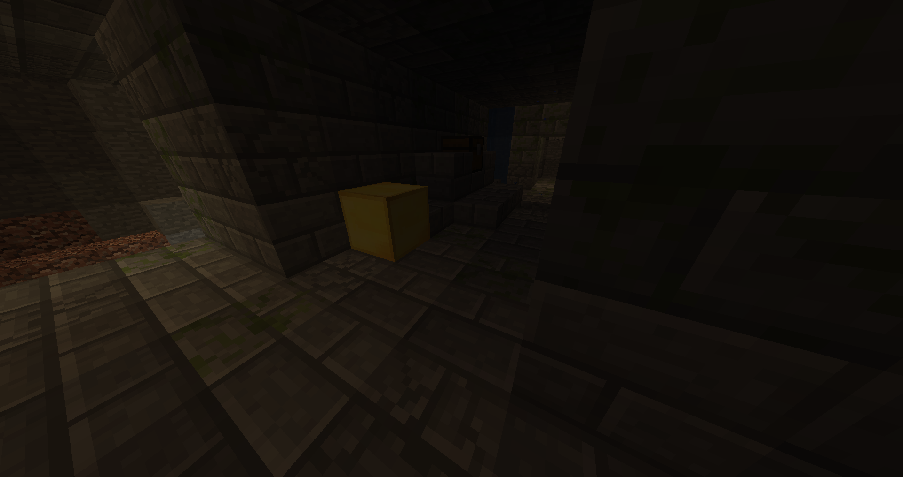

<h1>Computer Vision Distance Detector</h1>

<h2>Table of Contents</h2>
<ul>
    <li><a href="#overview">Overview</a></li>
    <li><a href="#instructions">Instructions</a>
        <ul>
            <li><a href="#setup-virtual-environment">Setup virtual environment</a></li>
            <li><a href="#run-app">Run the Application</a></li>
        </ul>
    </li>
    <li><a href="#steps">Steps</a>
        <ul>
            <li><a href="#histogram-training">Histogram Training</a></li>
            <li><a href="#scene">Scene</a></li>
            <li><a href="#canny-edge">Canny Edge Detection</a></li>
            <li><a href="#projective-transformation">Projective Transformation</a></li>
            <li><a href="#k-means">K-Means Clustering</a></li>
            <li><a href="#hough-transform">Hough Transformation</a></li>
        </ul>
    </li>

</ul>

<h2>Overview:</h2>

This is a computer vision project created in Python with computer vision libraries to
determine the distance between two target objects in a given scene. The scenes and training images
are depicted from a popular sandbox game.

<h2>Instructions:</h2>

Follow the steps below to run the application.

<h3 id="setup-virtual-environment">
Setup virtual environment
</h3>
<pre><code class="language-bash">
python3 -m venv venv;
pip install -r requirements.txt;
</code></pre>

<h3 id="run-app">
Run the application
</h3>
<pre><code class="language-bash">
python3 main.py;
</code></pre>

<h2>Steps:</h2>

<h3 id="histogram-training">
Histogram Training
</h3>

This step will process training images to get an understanding of
how the target block should look based on color values. The training images have (gold) target blocks shown
from different angles and under different lighting situations. Once the histogram training is complete,
the histogram model can be used to filter for target blocks by its most frequent colors..

For more info about Color Histograms:
    <a href="https://en.wikipedia.org/wiki/https://en.wikipedia.org/wiki/Color_histogram" target="_blank">Color Histograms</a>

Below are some sample images used to train the histogram model.
There are roughly 50 training images used for the histogram training.

  

    
  

 

    
  

 

    
  

 

    
  

 

    
  

 

    
  

<h3 id="scene">
Scene
</h3>

For the purpose of this walkthrough, the scene image shown below will be used.

<h3 id="canny-edge">
Canny Edge Detection
</h3>

The Canny Edge Detection algorithm is used to detect the edges in a given image.

For more info about the Canny Edge Detection Algorithm:
    <a href="https://en.wikipedia.org/wiki/Canny_edge_detector" target="_blank">Canny Edge
        Detector</a>

Applying the Canny Edge detector to the scene image gives us this result:

<h3 id="projective-transformation">
Projective Transformation
</h3>

                        
The Projective Transformation technique is used to transform an image from a perspective
into a 2D overhead view.

For more info about the Projective Transformations:
    <a href="https://www.graphicsmill.com/docs/gm5/Transformations.htm" target="_blank">Projective Transformations</a>

                        
The bounds for the Projective Transformation are determined and then highlighted in red for a visual representation.

                        
Once the Projective Transformation is completed, the result looks like the image shown below.

<h3 id="k-means">
K-Means Clustering
</h3>

K-Means Clustering will be used to find 2 points in the transformed image that
correspond to the center points of each of the target blocks.

For more info about K-Means Clustering:
    <a href="https://en.wikipedia.org/wiki/K-means_clustering" target="_blank">K-Means Clustering</a>

Setting K=2 and using the pixels in the target blocks as data points, we get two points corresponding to the centers 
of the target blocks, which are marked by the red dots.

<h3 id="hough-transform">
Hough Transformation
</h3>

The Hough Transformation is used for the last result image to count the number of horizontal and vertical lines between the two highlight
points. These two values are used with the Euclidean Distance Formula to determine the distance between the two target blocks.

For more info about the Hough Transformation:
    <a href="https://en.wikipedia.org/wiki/Hough_transform" target="_blank">Hough Transform</a>

